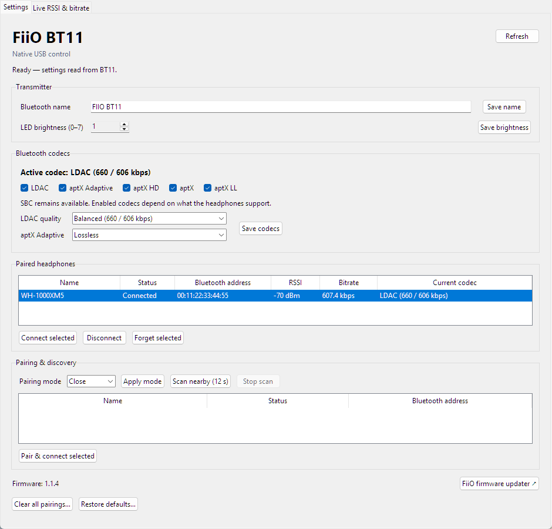
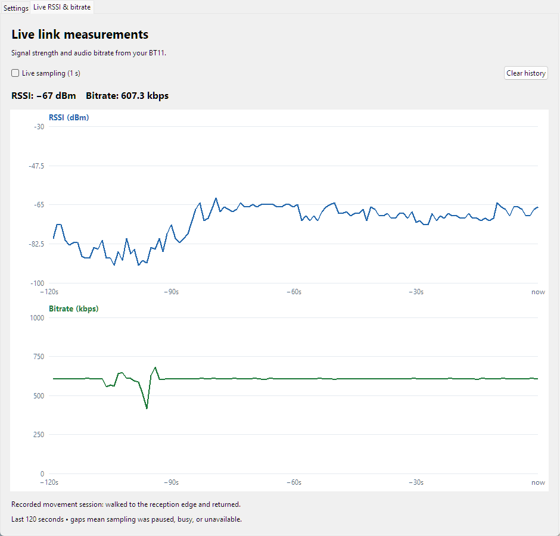

# FiioControlPy

Native Windows Python control for the **FiiO BT11** USB Bluetooth transmitter.
The app communicates directly over USB HID; Chrome and the FiiO web app are not
needed for ordinary settings or headphone connections.

## Screenshots

Settings, paired headphones, and live codec/RSSI/bitrate readings
(Bluetooth address replaced with an example for the screenshot):



Live graphs with two minutes of history. This screenshot replays a recorded
movement session, walking to the reception edge and returning:



## Setup

Requirements: Windows, Python 3.12 or later, [uv](https://docs.astral.sh/uv/),
and a connected BT11. Dependencies are pinned in `uv.lock`.

Clone the repository, then run the setup commands from its directory:

```powershell
git clone https://github.com/elrond1999/FiioControlPy.git
cd FiioControlPy
```

```powershell
uv sync --locked
powershell -NoProfile -ExecutionPolicy Bypass -File scripts/install-bt11-shortcut.ps1
```

The installer creates two desktop shortcuts:

- **FiiO BT11 Control** opens the settings window.
- **Connect WH-1000XM5** connects the configured headphones and closes after success.

The quick-connect helper is configured for the original user's paired WH-1000XM5.
For another headset, update `ADDRESS` and `NAME` in `scripts/connect-bt11.py`.
The settings panel discovers the transmitter's paired list and can control any
headphones shown there. Only one BT11 should be connected at a time.

## Native settings

- Bluetooth transmitter name and LED brightness (0–7).
- LDAC, aptX Adaptive, aptX HD, aptX and aptX LL enable/disable.
- LDAC quality and aptX Adaptive latency, quality and lossless modes.
- Codec changes apply directly without automatic disconnect/reconnect.
  Unchanged settings are not rewritten.
- Paired-device list, connect, disconnect and forget.
- Paired-device rows show live RSSI, bitrate and current codec for the single
  connected headphone. Disconnected rows show dashes. With multiple connected
  headphones, the app identifies the readings as shared in the live tab rather
  than assigning transmitter-level readings to individual headphones.
- Close, Auto and Manual pairing modes; nearby discovery; pair and connect.
- Clear pairings and restore defaults, with confirmation dialogs.
- Firmware version display.
- Active Bluetooth codec, refreshed every second while idle, including
  the reported LDAC bitrate mode and aptX Adaptive quality/lossless status.
- Live RSSI and bitrate graphs with 120 seconds of history, pause and clear controls.
  Sampling pauses during device operations; missing measurements appear as gaps.

Firmware flashing is not implemented natively. The settings window links to the
official FiiO web updater for that operation. Codec availability depends on the
headphones and transmitter firmware; enabling a codec does not force its use.
Windows audio-output selection is not changed by this application.

Click **Refresh** to read actual settings or after reconnecting USB. Scan runs
for 12 seconds, can be stopped, and restores the previous pairing mode. Auto
discovery can pair nearby headphones automatically and asks before it begins.
If responses time out, close other FiiO control applications and refresh.
Live sampling stops on transport failure; Refresh resumes sampling. If the
BT11 disappears from USB after a codec change, close the control window and
unplug/reinsert the dongle. On the tested BT11, audio playback with LDAC disabled
was reported to freeze the blue LED even after replugging/reconnecting; re-enabling
LDAC restored operation. Disconnecting before the change did not prevent that
failure, so codec saves no longer disconnect automatically.

## Commands

```powershell
uv run python scripts/bt11-control.py
uv run python scripts/bt11-control.py --diagnose
uv run python scripts/connect-bt11.py --cli
uv run python scripts/connect-bt11.py --status
uv run python -m unittest discover -s scripts -p 'test_bt11*.py'
```

## Layout

- `scripts/bt11.py`: BT11 protocol and USB transport for the settings panel.
- `scripts/bt11-control.py`: Tkinter settings panel.
- `scripts/connect-bt11.py`: dedicated quick-connect helper.
- `scripts/install-bt11-shortcut.ps1`: uv setup and desktop shortcuts.
- `scripts/test_bt11.py`, `scripts/test_bt11_gui.py`: automated tests.
- `scripts/check-settings.py`: opt-in hardware test that briefly changes LED
  brightness, restores it, and writes the existing values of other settings.

## Validation and scope

Tested on a BT11 running firmware 1.1.4 with WH-1000XM5 headphones. Validation
included native reconnection, settings reads and write/read checks, manual
discovery with pairing-mode restoration, GUI startup/layout, and 21 automated
protocol/GUI tests. Active-codec parsing and background updates also have
automated coverage. New pairing, forgetting, factory reset and automatic pairing
were not exercised on the original user's hardware.

BT11 USB identifiers: VID `0x0A12`, PID `0x4007`, usage page `0xFF00`, usage `3`.
Commands use output report 7, with replies on report 8. Ordinary controls use
feature 24; firmware version and discovery subscription use core feature 0.
The protocol was mapped from the user's local FiiO Control mirror and verified
against the device. No mirrored web assets are included in this project.

Active codec uses command `0x71` with payload `04`, inspected in FiiO's official
Android Control 4.6.0 app and verified on this BT11. It reports the negotiated
codec and quality mode, not a measurement of instantaneous audio throughput.
Firmware without this command displays Unavailable; ordinary settings remain usable.

The graph decodes payload offsets 8–11 as a little-endian unsigned bitrate in
bits/s and 12–13 as signed little-endian RSSI in dBm. These interpretations are
supported by a three-minute movement test on the user's BT11: signal values
fell to -92 at the reception edge and recovered near -67, while the bitrate
field normally stayed near 607 kbps and dipped during weak reception. FiiO's
Android app does not document or decode these fields. Their exact measurement
semantics and applicability to other firmware remain unverified. This is not
a packet-loss measurement, and the graphs are transmitter-level rather than
per-headphone measurements.

This is an unofficial utility and is not affiliated with FiiO. No support for
other transmitter models is claimed.
